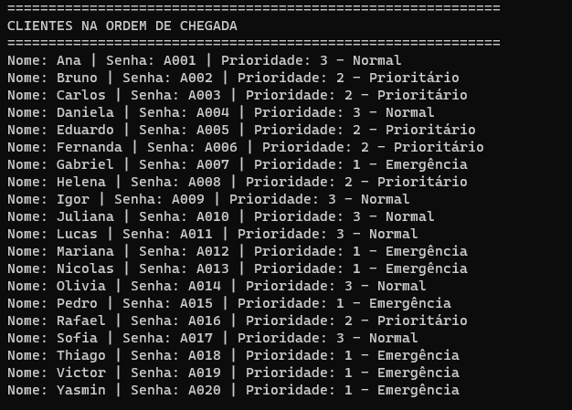
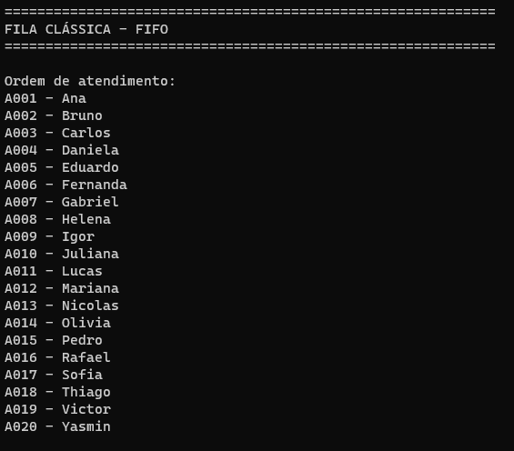
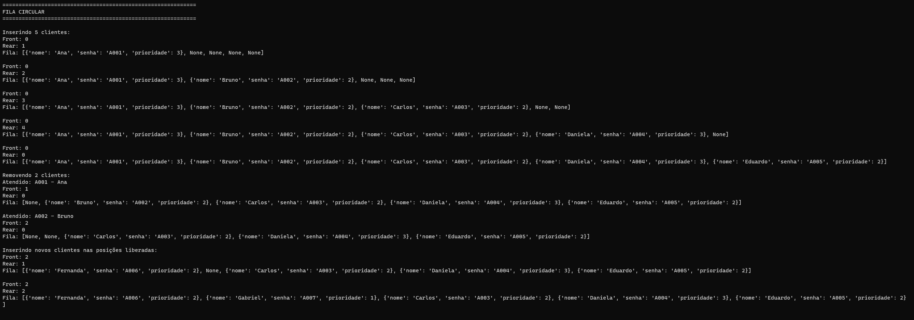
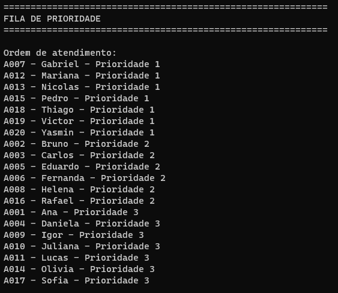

# Atividade-4---Estrutura-de-Dados-II
# Sistema Inteligente de Atendimento

## Integrante

* Matheus Queirós de Sousa Araújo Carvalho - RG: 42439892


## Descrição

Este projeto foi desenvolvido em Python com o objetivo de simular diferentes formas de organização de clientes em uma central de atendimento.

Foram implementadas três estruturas de dados:

* Fila clássica (FIFO);
* Fila circular;
* Fila de prioridade.

Cada cliente possui três informações:

* Nome;
* Senha;
* Prioridade.

As prioridades utilizadas são:

* **1 — Emergência**
* **2 — Prioritário**
* **3 — Atendimento normal**

O projeto também possui um menu interativo para inserção e atendimento de clientes.

---

## Estrutura do projeto

```text
fila-atendimento-hands-on/
│
├── main.py
├── fila.py
├── fila_circular.py
├── fila_prioridade.py
└── README.md
```

### `fila.py`

Implementa a fila clássica utilizando o princípio FIFO (First In, First Out).

Operações implementadas:

* `enqueue()` — adiciona um cliente;
* `dequeue()` — remove e atende o primeiro cliente;
* `head()` — consulta o próximo cliente;
* `size()` — retorna o tamanho da fila;
* `empty()` — verifica se a fila está vazia.

Na fila clássica, o primeiro cliente que chega é o primeiro a ser atendido.

---

## Fila Circular

A classe `FilaCircular` possui capacidade para cinco clientes.

A estrutura utiliza as posições `front` e `rear` para controlar, respectivamente, onde está o primeiro elemento e onde será inserido o próximo.

Quando um cliente é removido, a posição liberada pode ser reutilizada posteriormente.

O índice é atualizado utilizando:

```python
(rear + 1) % capacidade
```

Isso permite que o índice volte para o início do vetor quando chegar ao final.

### Exemplo

Considerando uma fila com cinco posições:

```text
[0] [1] [2] [3] [4]
```

Após inserir cinco clientes, as posições ficam ocupadas.

Quando os primeiros clientes são removidos, suas posições ficam disponíveis novamente.

Novos clientes podem então ocupar essas posições, demonstrando o funcionamento circular da estrutura.

### Fila circular cheia

Quando a fila circular está cheia, não é possível inserir outro elemento.

Nesse caso, o programa informa:

```text
Fila circular cheia!
```

O novo cliente não é inserido até que uma posição seja liberada.

---

## Fila de Prioridade

A fila de prioridade foi implementada utilizando o módulo `heapq` do Python.

Cada elemento armazenado possui:

```python
(prioridade, contador, cliente)
```

A prioridade possui três valores:

```text
1 = Emergência
2 = Prioritário
3 = Normal
```

Como o `heapq` trabalha com os menores valores primeiro, os clientes com prioridade 1 são atendidos antes dos clientes de prioridade 2 e 3.

O contador é utilizado para preservar a ordem de chegada quando dois clientes possuem a mesma prioridade.

Por exemplo:

```text
Cliente A → prioridade 2 → chegou primeiro
Cliente B → prioridade 2 → chegou depois
```

Nesse caso, o Cliente A será atendido antes do Cliente B.

---

# Desafio Final

O programa gera automaticamente 20 clientes.

Para cada cliente são gerados:

- Nome;
- Senha;
- Prioridade entre 1 e 3.

Em seguida, o sistema apresenta:

1. Clientes na ordem de chegada;
2. Ordem de atendimento da fila clássica;
3. Funcionamento da fila circular;
4. Ordem de atendimento da fila de prioridade.

---

# Evidências dos testes

## Clientes gerados

Abaixo está o resultado da execução mostrando os 20 clientes gerados automaticamente:



## Fila clássica

A execução demonstra que os clientes são atendidos seguindo a ordem de chegada (FIFO):



## Fila circular

A execução demonstra a movimentação dos índices `front` e `rear` e a reutilização das posições liberadas:



## Fila de prioridade

A execução demonstra que clientes com prioridade 1 são atendidos antes dos clientes de prioridade 2 e 3:



---

# Comparação das estruturas

## Fila clássica

A fila clássica mantém exatamente a ordem de chegada.

Exemplo:

```text
Chegada:
A → B → C → D

Atendimento:
A → B → C → D
```

Essa estrutura é adequada quando todos os clientes devem ser atendidos seguindo a ordem em que chegaram.

## Fila circular

A fila circular utiliza um espaço limitado e permite reutilizar posições que foram liberadas após a remoção de elementos.

Uma vantagem é o melhor aproveitamento de um vetor de tamanho fixo, evitando a necessidade de deslocar todos os elementos após cada remoção.

Uma limitação é possuir capacidade limitada. Quando todas as posições estão ocupadas, um novo elemento não pode ser inserido.

## Fila de prioridade

Na fila de prioridade, a ordem de atendimento depende da prioridade do cliente e não apenas da ordem de chegada.

Por isso, sua ordem pode ser diferente da fila clássica.

Por exemplo:

```text
Chegada:

Carlos → prioridade 3
Ana → prioridade 1
João → prioridade 2
```

Fila clássica:

```text
Carlos → Ana → João
```

Fila de prioridade:

```text
Ana → João → Carlos
```

Isso ocorre porque a prioridade 1 possui preferência sobre as prioridades 2 e 3.

---

# Questões do relatório

## 1. Por que a ordem de atendimento da fila de prioridade pode ser diferente da ordem da fila clássica?

Na fila clássica, o atendimento segue o princípio FIFO, portanto o primeiro cliente que chega é o primeiro a ser atendido.

Na fila de prioridade, a ordem depende do nível de prioridade de cada cliente. Dessa forma, um cliente que chegou depois pode ser atendido antes de outro que chegou anteriormente caso possua uma prioridade maior.

Quando dois clientes possuem a mesma prioridade, o sistema utiliza um contador para manter a ordem de chegada entre eles.

---

## 2. Em quais situações reais uma fila de prioridade seria mais adequada?

Uma fila de prioridade pode ser utilizada em situações nas quais alguns atendimentos precisam ser realizados antes de outros.

Alguns exemplos são:

* Centrais de atendimento de emergência;
* Hospitais;
* Suporte técnico;
* Sistemas operacionais;
* Atendimento de chamados;
* Sistemas de processamento de tarefas.

Em um hospital, por exemplo, uma pessoa em situação de emergência pode precisar ser atendida antes de uma pessoa que apresenta uma situação menos urgente, independentemente da ordem em que chegaram.

---

## 3. Quais são as vantagens e limitações de uma fila circular?

### Vantagens

* Permite reutilizar posições liberadas;
* Aproveita melhor uma estrutura de tamanho fixo;
* Não necessita deslocar todos os elementos após uma remoção;
* É adequada para sistemas que trabalham com buffers e armazenamento temporário.

### Limitações

* Possui capacidade limitada;
* É necessário controlar os índices `front` e `rear`;
* Uma tentativa de inserção quando a fila está cheia deve ser tratada pelo programa;
* A implementação é um pouco mais complexa que uma fila simples.

---

## 4. O que acontece ao tentar inserir um elemento em uma fila circular cheia?

Quando todas as posições da fila circular estão ocupadas, não existe espaço disponível para armazenar um novo cliente.

Nesse projeto, o programa identifica essa situação e apresenta:

```text
Fila circular cheia!
```

O elemento não é inserido até que algum cliente seja removido e uma posição seja liberada.

---

# Conclusão

A atividade permitiu comparar três formas diferentes de organização de dados.

A fila clássica utiliza o princípio FIFO e mantém a ordem de chegada. A fila circular permite reutilizar posições de uma estrutura de tamanho limitado. Já a fila de prioridade altera a ordem de atendimento de acordo com a prioridade de cada cliente.

A implementação demonstrou que a escolha da estrutura de dados depende do problema que está sendo resolvido. Cada estrutura possui características próprias e pode ser utilizada em diferentes situações.

---

# Como executar

É necessário possuir o Python instalado.

No terminal, execute:

```bash
python main.py
ou
py main.py
```

Depois escolha uma das opções apresentadas pelo sistema:

```text
1 - Executar desafio completo
2 - Menu interativo
0 - Sair
```

O projeto não necessita de bibliotecas externas, pois utiliza apenas recursos da biblioteca padrão do Python, incluindo o módulo `heapq`.
